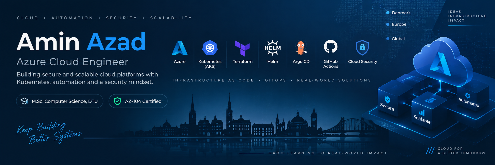

  

  <strong>Azure Cloud Engineer · AZ-104 · M.Sc. Computer Science and Engineering, DTU</strong> 
  AKS · Terraform · Kubernetes · Helm · GitHub Actions · Argo CD · Cloud Security

  
  
  

## About me

I am an AZ-104-certified Azure cloud engineer based in Copenhagen, with a cybersecurity-focused M.Sc. in Computer Science and Engineering from the Technical University of Denmark (DTU).

My main focus is Azure infrastructure and platform engineering: Terraform, AKS, Kubernetes, Helm, GitHub Actions, Argo CD, identity, networking, monitoring and cloud security.

I learn best by building real systems and then testing what happens when they fail. My projects include live Azure deployments, GitOps delivery, workload identity, tenant isolation, infrastructure-as-code, monitoring, controlled recovery tests and documented deployment failures.

Before focusing on cloud engineering, I worked in IT support and digital transformation, including supporting more than 100 users across hardware, software and networking. That experience still shapes how I work: understand the problem, make the change, verify it, document the evidence and keep the system maintainable.

## Featured project

### [NordicShop — Azure AKS platform](https://github.com/Amin-Azad/nordicshop-aks-platform)

My main cloud/platform engineering project: a small multi-tenant marketplace used to build and operate an Azure Kubernetes platform end to end.

- Azure infrastructure built with reusable Terraform modules
- AKS, VNet, ACR, Key Vault, managed identities, RBAC and remote Terraform state
- Kubernetes workloads packaged with Helm and reconciled by Argo CD
- GitHub Actions with Azure OIDC and immutable ACR image digests
- separate AKS Workload Identities for the API and database administration path
- per-secret Azure Key Vault RBAC instead of shared vault-wide access
- PostgreSQL Row-Level Security plus API-level tenant authorization
- Azure Managed Prometheus, Managed Grafana and alerting
- controlled recovery tests for invalid images and PostgreSQL outages
- tenant-isolation verification: 11 passed / 0 failed
- PostgreSQL RLS lab: 18 passed / 0 failed
- final Terraform plan: no drift
- final Argo CD state: Synced / Healthy

The application is intentionally simple. The main goal of the project is the platform around it: infrastructure, delivery, identity, security, observability and recovery.

## Other Azure projects

### [CloudNest — deployed Azure infrastructure with Bicep](https://github.com/Amin-Azad/cloudnest-bicep)

A production-style Azure design with a smaller cost-controlled deployment that I successfully deployed and verified.

- Bicep, GitHub Actions and workload identity federation
- App Service, Azure SQL, VNets, private endpoints and private DNS
- Managed Identity, Key Vault RBAC and Storage RBAC
- Log Analytics, Application Insights, alerts and Azure Policy
- guarded validation, What-If, deployment and cleanup workflows
- successful Sweden Central deployment with 32 verified live resources
- 100% Azure Policy compliance before cost-controlled cleanup

### [Nordic Shopping — Azure cloud transformation case study](https://github.com/Amin-Azad/nordic-shopping-cloud-transformation)

An end-to-end infrastructure and deployment-automation case study for a fictional Copenhagen e-commerce business.

- multi-region Azure design using West Europe and Sweden Central
- modular subscription-scope Bicep with dev and production parameters
- Front Door, WAF, App Service, Azure SQL, Key Vault and private networking
- GitHub Actions OIDC and guarded deployment workflows
- cost estimation, security assessment, migration planning and recovery design
- two controlled development deployment attempts with root-cause analysis and verified cleanup

### [Azure 3-Tier Infrastructure — Azure CLI and Bash](https://github.com/Amin-Azad/azure-3tier-cli-project)

A modular command-line deployment of a three-tier Azure environment.

- Azure CLI and reusable Bash modules
- VNets, subnets, NSGs, Load Balancer and Linux VMs
- Storage, Entra ID, Managed Identity and RBAC
- Azure Monitor, Log Analytics and Recovery Services Vault
- validation, deployment evidence and cleanup automation

## Technical focus

| Area | Tools and services |
| --- | --- |
| Cloud | Microsoft Azure, Azure Portal, Azure CLI |
| Infrastructure as code | Terraform, Bicep, ARM deployment scopes, remote state, What-If |
| Containers and Kubernetes | Docker, Docker Compose, Kubernetes, AKS, Helm |
| CI/CD and GitOps | GitHub Actions, OIDC federation, Argo CD, immutable image digests |
| Networking | VNets, subnets, NSGs, Azure Load Balancer, Gateway API, private endpoints, private DNS, Front Door, WAF |
| Identity and security | Microsoft Entra ID, Managed Identity, Workload Identity, Azure RBAC, Key Vault, least privilege |
| Observability | Azure Monitor, Log Analytics, Managed Prometheus, Managed Grafana, alerts |
| Data and platform security | PostgreSQL, Row-Level Security, Redis, tenant isolation |
| Cybersecurity | Network security, incident response, threat analysis, risk assessment, ISO 27001/27005 |
| Security tooling | Wireshark, Suricata, IDS, SIEM concepts, OWASP Juice Shop |
| Scripting and tools | Bash, PowerShell, Python, SQL, Git, GitHub, Linux, WSL2 |

## Cybersecurity and academic background

**M.Sc. in Computer Science and Engineering — Technical University of Denmark (DTU), 2023–2025**

Specialization: cybersecurity, networking, system security and distributed systems.

Relevant coursework includes Computer Security Incident Response, Data Security, Network Security, Logic for Security, Modern Cryptology, Distributed Real-Time Systems and System Integration.

My master's thesis, *Blockchain-Enabled Cybersecurity for Cyber-Ship Systems: A Risk Assessment Approach*, examined maritime cybersecurity resilience, incident response and risk assessment using ISO 27001/27005.

Selected security work includes:

- access-control implementation and comparison of ACL and RBAC policies
- incident-response runbook design
- network attack analysis with Wireshark and Suricata
- XSS, SQL injection and XXE testing in OWASP Juice Shop
- phishing detection using machine-learning models

**B.Sc. in Computer Science and Engineering — North South University, 2015–2019**

## What I am looking for

I am interested in cloud and platform engineering roles such as:

- Azure Cloud Engineer
- Cloud Platform Engineer
- Cloud Infrastructure Engineer
- Junior / Associate DevOps Engineer
- Azure Administrator
- Cloud Security Engineer
- Azure Operations Engineer

I bring AZ-104 certification, a cybersecurity-focused DTU master's degree, previous IT support experience and practical experience building, deploying, securing, monitoring and troubleshooting Azure infrastructure.

I am primarily interested in opportunities in Denmark and am also open to relevant roles elsewhere in Europe.

## Contact

- [LinkedIn](https://www.linkedin.com/in/azadamin079/)
- [Email](mailto:azadamin079@gmail.com)
- Copenhagen, Denmark

  Infrastructure claims on this profile are linked to code, workflow history or deployment evidence in the relevant repositories.

