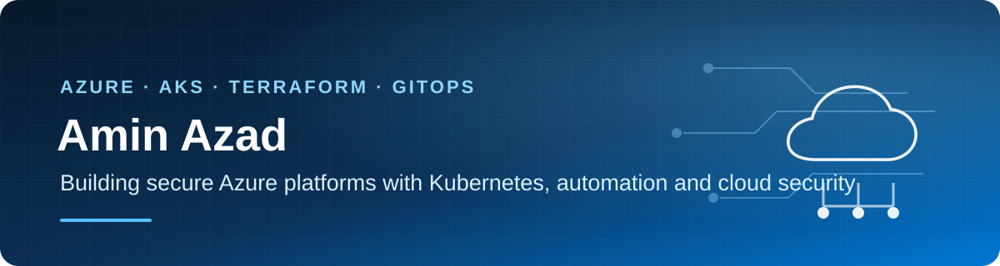

  

  <strong>AZ-104 Certified Azure Administrator · M.Sc. Computer Science and Engineering, DTU</strong> 
  Cybersecurity, Networking and Distributed Systems · Copenhagen, Denmark

  
  
  

## About me

I am an AZ-104-certified Azure cloud and infrastructure engineer based in Copenhagen, with a cybersecurity-focused M.Sc. in Computer Science and Engineering from the Technical University of Denmark (DTU). My academic work specialized in cybersecurity, networking and distributed systems; my practical work combines Azure administration, infrastructure automation, identity and access management, network security and IT operations.

Before focusing on cloud infrastructure, I worked in IT support and digital transformation, including supporting more than 100 users across hardware, software and networking. That background shapes how I approach cloud engineering: secure configuration, clear troubleshooting, practical operations and infrastructure that can actually be maintained.

My projects include both successful Azure deployments and controlled deployment failures. I document the difference clearly. The strongest lessons have come from testing assumptions against a real subscription, tracing quota and identity problems, improving readiness checks, and cleaning up safely when a deployment should not continue.

## Selected Azure projects

### [CloudNest — deployed Azure infrastructure with Bicep](https://github.com/Amin-Azad/cloudnest-bicep)

A production-style design with a smaller cost-controlled portfolio profile that I successfully deployed and verified in Azure.

- Bicep, GitHub Actions and workload identity federation (OIDC)
- App Service, Azure SQL, VNets, private endpoints and private DNS
- Managed Identity, Key Vault RBAC and Storage RBAC
- Log Analytics, Application Insights, alerts and Azure Policy
- Guarded validation, What-If, deployment and cleanup workflows
- Successful Sweden Central deployment with 32 verified live resources
- 100% Azure Policy compliance before cost-controlled cleanup

**Evidence:** the repository includes a successful GitHub Actions run, live Azure verification and 20 screenshots. Front Door, WAF, disaster recovery, deployment slots and autoscaling remain part of the wider Bicep design; they were not enabled in the smaller deployment.

### [Nordic Shopping — Azure cloud transformation case study](https://github.com/Amin-Azad/nordic-shopping-cloud-transformation)

An end-to-end infrastructure and deployment-automation case study for a fictional Copenhagen e-commerce business.

- Multi-region Azure design using West Europe and Sweden Central
- Modular subscription-scope Bicep with dev and production parameters
- Front Door, WAF, App Service, Azure SQL, Key Vault and private networking
- GitHub Actions OIDC, protected environments and exact-commit deployment gates
- Cost estimation, security assessment, migration planning and recovery design
- Subscription readiness, region qualification and deployment regression checks
- Two controlled dev attempts with incident records and verified cleanup

**Status:** Bicep validation, guarded deployment workflows, root-cause analysis and cleanup are documented. Two development attempts reached resource creation and exposed subscription quota and SQL administrator constraints. Production was not deployed.

### [Azure 3-Tier Infrastructure — Azure CLI and Bash](https://github.com/Amin-Azad/azure-3tier-cli-project)

A modular command-line deployment of a three-tier Azure environment.

- Azure CLI and reusable Bash modules
- VNets, subnets, NSGs, Load Balancer and Linux VMs
- Storage, Entra ID, Managed Identity and RBAC
- Azure Monitor, Log Analytics and Recovery Services Vault
- Validation, deployment evidence and cleanup automation

## Cybersecurity and academic background

**M.Sc. in Computer Science and Engineering — Technical University of Denmark (DTU), 2023–2025**

Specialization: cybersecurity, networking, system security and distributed systems.

Relevant coursework: Computer Security Incident Response (02192), Data Security (02239), Network Security (02233), Logic for Security (02244), Modern Cryptology (02255), Distributed Real-Time Systems (02225), System Integration (02291), and Process-Oriented & Event-Driven Software Systems (02268).

My master's thesis, *Blockchain-Enabled Cybersecurity for Cyber-Ship Systems: A Risk Assessment Approach*, examined maritime cybersecurity resilience, incident response and risk assessment using ISO 27001/27005.

Selected DTU security projects:

- **Access control:** implemented and compared ACL and RBAC policies in a Java-based print server.
- **Incident response:** developed a data-leakage response runbook covering detection, containment, eradication, recovery and escalation.
- **Network defense:** analyzed attack traffic with Wireshark and wrote Suricata intrusion-detection rules for reverse shells, malicious SSH logins and protocol exploits.
- **Web application security:** investigated XSS, SQL injection and XXE in an OWASP Juice Shop lab.
- **Phishing detection:** compared machine-learning models for identifying phishing websites.

**B.Sc. in Computer Science and Engineering — North South University, 2015–2019**

## Technical focus

| Area | Tools and services |
| --- | --- |
| Cloud | Microsoft Azure, Azure Portal, Azure CLI |
| Infrastructure as code | Bicep, ARM deployment scopes, parameter files, What-If |
| Delivery | GitHub Actions, OIDC federation, environment protection, CI validation |
| Networking | VNets, subnets, NSGs, private endpoints, private DNS, Load Balancer, Front Door, WAF |
| Identity and cloud security | Microsoft Entra ID, Managed Identity, RBAC, ACL, Key Vault, least privilege |
| Cybersecurity | Network security, incident response, threat analysis, risk assessment, ISO 27001/27005 |
| Security tooling | Wireshark, Suricata, IDS, SIEM concepts, OWASP Juice Shop |
| Operations | Azure Monitor, Log Analytics, Application Insights, alerts, Azure Policy, budgets |
| IT administration | Microsoft 365, Windows Server, Active Directory, Group Policy, technical support |
| Scripting and tools | Bash, PowerShell, Python, SQL, Git, GitHub, Linux, WSL2 |

## What I am looking for

I am interested in junior and early-career roles such as:

- Azure Cloud Engineer
- Azure Administrator
- Cloud Infrastructure Engineer
- Junior DevOps Engineer
- Cloud Security or Security Operations Engineer
- Azure Operations or Platform Support Engineer

I bring Microsoft Azure Administrator Associate certification, a cybersecurity-focused DTU master’s degree, previous IT support experience, and practical experience building, deploying, securing and troubleshooting Azure infrastructure. I am primarily interested in opportunities in Denmark and am also open to relevant roles in Germany.

## Contact

- [LinkedIn](https://www.linkedin.com/in/azadamin079/)
- [Email](mailto:azadamin079@gmail.com)
- Copenhagen, Denmark

  Infrastructure claims on this profile are linked to code, workflow history or deployment evidence in the relevant repository.

